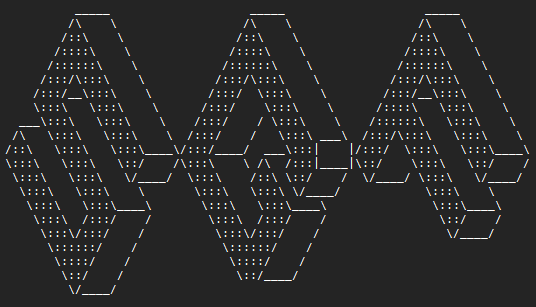
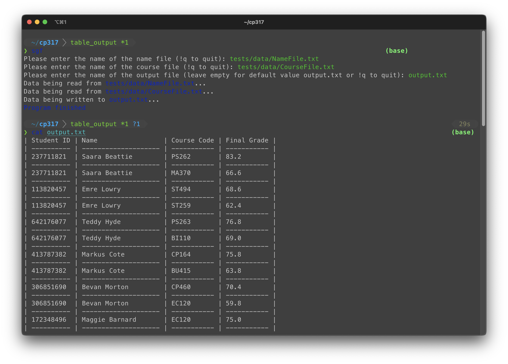

# CP317 PROJECT - Student Grades Formatter


# Quick Start

## System Requirements
1. Python 3.9.x or later - [Download](https://www.python.org/downloads/) from official site.
2. `Optional`
    - Get `git` to install from GitHub repository - [Download](https://git-scm.com/downloads) from official site.

## Installation Steps
### Install using `pip`.
```bash
python3 -m pip install sgf
```

### Install from GitHub repository
```bash
python3 -m pip install git+https://github.com/juancwu/cp317.git
```

## Try it out!
```bash
sgf
```


# Development Environment Setup

## 1. Install MiniConda
Follow the installation instructions for your operating system. [Download link](https://docs.conda.io/en/latest/miniconda.html)

## 2. Setup the virtual environment

```bash
conda env create -f env.yml
```

# Testing
Run the command below at the root level of the project.
```bash
python3 -m coverage run -m unittest -b
```
This will run all test cases and generate a coverage report.

## Check Test Coverage
View coverage report results.
```bash
coverage report
```

To view report as a website with more details run:
```bash
coverage html
python3 -m http.server 5555 --directory ./htmlcov
```

## Alternate way to run tests
Run the `test.py` file in the root level of the project. This option will run the tests but not create a coverage report.
```bash
python3 test.py
```

# Extras
## Export Environment
```bash
conda env export --from-history | grep -v "^prefix: " > env.yml
```
